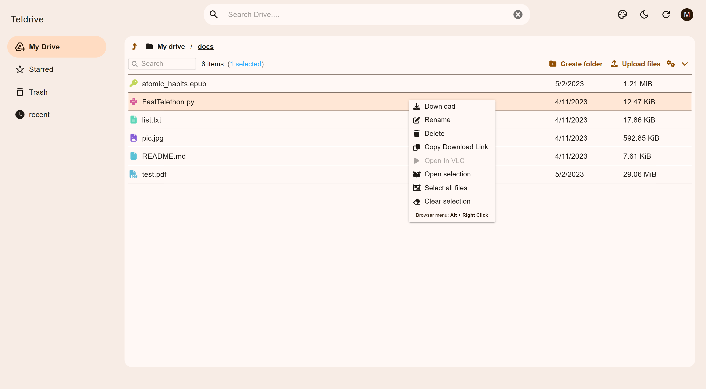

# Telegram Drive

Telegram Drive is a powerful utility that enables you to create your own cloud storage service using Telegram as the backend.

[](https://discord.gg/J2gVAZnHfP)

**Click on icon to join Discord Server for  more advanced configurations for uploads and better support**

[Read Wiki for FAQ](https://github.com/divyam234/teldrive/wiki).

<details open="open">
  <summary>Table of Contents</summary>
  <ol>
    <li>
      <ul>
      <li>
      <a href="#features">Features</a>
    </li>
        <li><a href="#deploy-using-docker-compose">Deploy using docker-compose</a></li>
       <li><a href="#use-without-docker">Use without docker</a></li>
      </ul>
    </li>
    <li><a href="#setting-up-things">Setting up things</a></li>
    <ul>
      <li><a href="#mandatory-vars">Mandatory Vars</a></li>
      <li><a href="#optional-vars">Optional Vars</a></li>
    </ul>
  </ol>
</details>

## Features

- **UI:** Based on Material You to create nice looking UI themes.
- **Secure:** Your data is secured using robust encryption.
- **Flexible Deployment:** Use Docker Compose or deploy without Docker.

## Demo



[UI Repo ](https://github.com/divyam234/teldrive-ui)

### Deploy using docker-compose

First clone the repository

```sh
git clone https://github.com/divyam234/teldrive
cd teldrive
touch teldrive.db
```

**Follow Below Steps**

- Create the `teldrive.env` file with your variables and start your container.

```sh
docker compose up -d
```

- **Go to http://localhost:8080**
- **Uploads from UI will be slower due to limitations of browser use [Rclone](https://github.com/divyam234/rclone) for faster uploads.Make sure to add bots.**
### Use without docker

**Follow Below Steps**

- Download the release binary of Teldrive from the releases section.

- Add same env file as above.
- Now, run the Teldrive executable binary directly.

## Setting up things

If you're locally or remotely hosting, create a file named `teldrive.env` in the root directory and add all the variables there.
An example of `teldrive.env` file:

```sh
APP_ID=1234
APP_HASH=abc
JWT_SECRET=abc
DATABASE_URL=postgres://<db username>:<db password>@<db host>/<db name>

```
When used with `docker-compose.postgres.yml`:
```
DATABASE_URL=postgres://teldrive:secret@db/teldrive
```

> [!IMPORTANT]
> Default Channel can be selected through UI make sure to set it from account settings on first login.<br>
> Use strong JWT secret instead of pure guessable string.You can use openssl to generate it.<br>

```bash
$ openssl rand -hex 32
```
Or generate from here https://generate-secret.vercel.app/32

**Multi Bots Mode is recommended to avoid flood errors and enable maximum download speed, especially if you are using downloaders like IDM and aria2c which use multiple connections for downloads.**

> [!NOTE]
> What it multi bots feature and what it does? <br>
> This feature shares the Telegram API requests between other bots to avoid getting floodwaited (A kind of rate limiting that Telegram does in the backend to avoid flooding their servers) and to make the server handle more requests. <br>

To enable multi bots, generate new bot tokens from BotFather and add it through UI on first login.

### Mandatory Vars

Before running the bot, you will need to set up the following mandatory variables:

- `APP_ID` : This is the API ID for your Telegram account, which can be obtained from my.telegram.org.

- `APP_HASH` : This is the API HASH for your Telegram account, which can be obtained from my.telegram.org.

- `JWT_SECRET` : Used for signing jwt tokens

- `DATABASE_URL` : Connection String obtained from Postgres DB (you can use Neon db as free alternative fro postgres)

### Optional Vars

In addition to the mandatory variables, you can also set the following optional variables:

- `HTTPS` : Only needed when frontend is on other domain (Default false).

- `PORT` : Change listen port default is 8080

- `ALLOWED_USERS` : Allow certain telegram usernames including yours to access the app.Enter comma seperated telegram usernames here.Its needed when your instance is on public cloud and you want to restrict other people to access you app.

- `COOKIE_SAME_SITE` : Only needed when frontend is on other domain (Default true).

- `BG_BOTS_LIMIT` : Start atmost BG_BOTS_LIMIT no of bots in background to prevent connection recreation on every request (Default 5).

- `UPLOAD_RETENTION` : No of days to keep incomplete uploads parts in channel afterwards these parts are deleted (Default 15).

- `ENCRYPTION_KEY`  : Password for Encryption.

- `DEV` : DEV mode to enable debug logging(Default false).

- `LOG_SQL` : Log sql queries (Default false).

> [!WARNING]
> Keep your Password safe once generated teldrive uses same encryption as of rclone internally 
so you don't need to enable crypt in rclone.**Teldrive generates random salt for each file part and saves in database so its more secure than rclone crypt whereas in rclone same salt value  is used  for all files which can be compromised easily**. Enabling crypt in rclone makes UI reduntant so encrypting files in teldrive internally is better way to encrypt files and more secure encryption than rclone.To encrypt files see more about teldrive rclone config.

### For making use of Multi Bots support

> [!WARNING]
> Bots will be auto added as admin in channel if you set them from UI if it fails somehow add it manually.

## FAQ

- How to get Postgres DB url ?
  > You can set up a local Postgres instance, but it's not recommended due to backup and data transfer hassles. The recommended approach is to use a free cloud-based Postgres DB like [Neon DB](https://neon.tech/).

## Contributing

Feel free to contribute to this project if you have any further ideas.

## Donate

If you like this project small contribution would be appreciated [Paypal](https://paypal.me/redux234).
